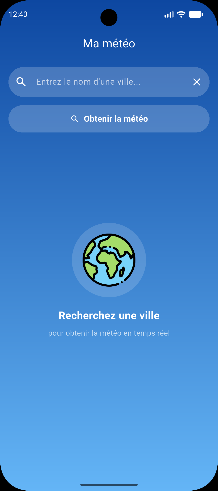
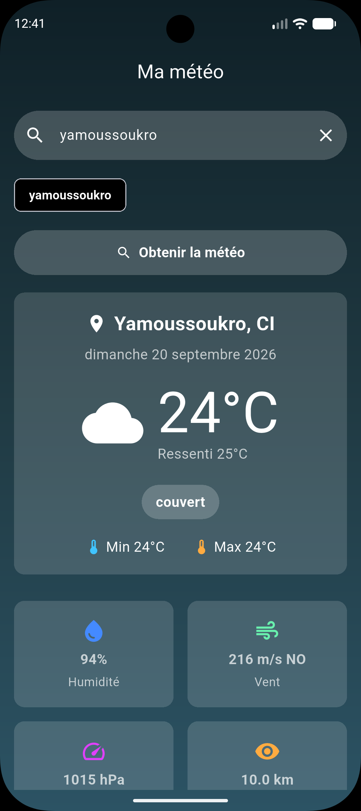
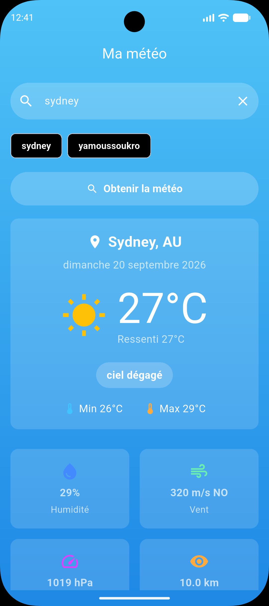

# 🌤️ Ma Météo App

Une application mobile Flutter élégante et réactive permettant de consulter les conditions météorologiques en temps réel de n'importe quelle ville.

Conçue avec une architecture **MVC** stricte, elle intègre une UI moderne basée sur le **Glassmorphism** et des arrière-plans dynamiques qui s'adaptent à la météo actuelle.

## Captures d'écran

<p align="center">
  
  &nbsp;&nbsp;&nbsp;
  
  &nbsp;&nbsp;&nbsp;
  
  
</p>

## Fonctionnalités principales

* **Données en Temps Réel :** Intégration de l'API OpenWeather pour des données météorologiques précises (température, humidité, pression, vent, etc.).
* **Interface Dynamique (Glassmorphism) :** L'arrière-plan de l'application s'anime et change de couleur dynamiquement en fonction du code météo (jour, nuit, pluie, nuages, etc.).
* **Historique de Recherche :** Sauvegarde des recherches récentes accessibles via des "Action Chips" stylisés.
* **Gestion d'État Robuste :** Utilisation de `Provider` pour une mise à jour fluide de l'interface utilisateur sans recharger l'arbre des widgets complet.
* **Gestion d'Erreurs Complète :** Interception des codes HTTP (401, 404, 429) et des erreurs réseau avec affichage de messages clairs pour l'utilisateur.
* **Localisation (FR) :** Dates, heures et descriptions météorologiques entièrement formatées en français via le package `intl`.
* **Splash Screen Natif :** Écran de démarrage personnalisé généré via `flutter_native_splash`.

## Architecture & Technologies

Ce projet respecte le pattern **Modèle-Vue-Contrôleur (MVC)** pour garantir un code maintenable et évolutif :

* **`models/`** : Définition des structures de données (`WeatherModel`).
* **`views/`** : Écrans et assemblage visuel.
* **`widgets/`** : Composants UI modulaires et réutilisables (`WeatherWidgets`, `WeatherDetailCard`, etc.).
* **`controllers/`** : Logique métier gérée via `ChangeNotifier` (`WeatherController`).
* **`services/`** : Couche réseau gérant les requêtes HTTP et le parsing JSON (`WeatherService`).
* **`utils/`** : Fonctions d'assistance statiques pour le formatage (UI, Dates, Températures).

**Dépendances clés :**
* `provider` (Gestion d'état)
* `http` (Requêtes réseau)
* `flutter_dotenv` (Sécurité des clés API)
* `intl` (Internationalisation et formatage)
* `flutter_native_splash` (Splash screen)
* `package_rename` (Configuration du package Android/iOS)

## Installation & Configuration

### 1. Prérequis
* Flutter SDK (v3.13.1 ou supérieur)
* Une clé API gratuite [OpenWeatherMap](https://openweathermap.org/api)

### 2. Cloner le projet
```bash
git clone [https://github.com/yamariel/meteo_app.git](https://github.com/yamariel/meteo_app.git)
cd meteo_app
````
### 3. Installer les dépendances
```bash
flutter pub get
```
### 4. Configurer les variables d'environnement
Créez un fichier .env à la racine du projet et ajoutez vos identifiants OpenWeather :
```text
apiKey=VOTRE_CLE_API_OPENWEATHER_ICI
baseUrl=[https://api.openweathermap.org/data/2.5/weather](https://api.openweathermap.org/data/2.5/weather)
```
### 5. Lancer l'application
```bash
flutter run
````
## Auteur
- [Ariel Yamien](github.com/yamariel)
- Développeur Web & Mobile